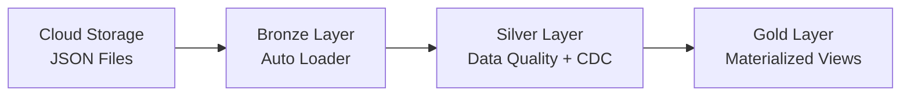
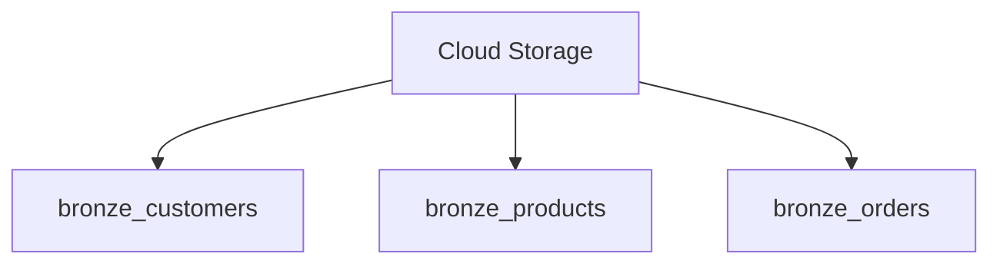
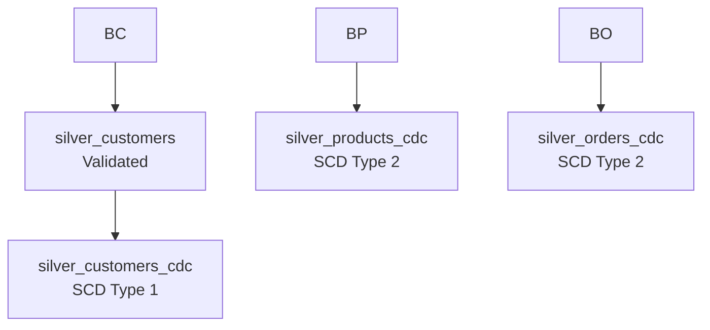
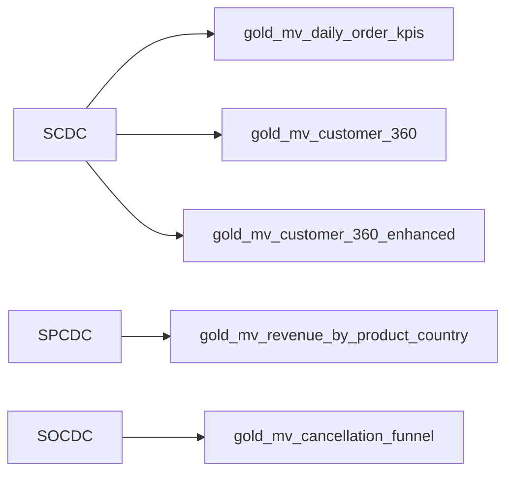

# 🏪 LakehouseMart Data Pipeline

## Overview
This Spark Declarative Pipeline implements a complete **Medallion Architecture** (Bronze → Silver → Gold) for an e-commerce analytics platform. It ingests raw customer, product, and order data from cloud storage, applies data quality checks and Change Data Capture (CDC) transformations, and produces analytics-ready datasets for business intelligence.

---

## 📊 Pipeline Architecture

### 🏗️ Medallion Architecture (High Level)



---

### **Bronze Layer** (Raw Data Ingestion)
Streaming tables that ingest raw JSON files from cloud storage using Auto Loader:



* **bronze_customers** – Raw customer data with schema inference and evolution
* **bronze_products** – Raw product catalog data
* **bronze_orders** – Raw order transaction data

---

### **Silver Layer** (Cleaned & CDC-Enabled)
Streaming tables with data quality constraints and CDC processing:



* **silver_customers** – Validated customer records (non-null constraints on key fields)
* **silver_customers_cdc** – Current customer state (SCD Type 1)
* **silver_products_cdc** – Historical product changes (SCD Type 2)
* **silver_orders_cdc** – Historical order lifecycle tracking (SCD Type 2)

---

### **Gold Layer** (Analytics-Ready Views)
Materialized views optimized for business reporting and analytics:



* **gold_mv_daily_order_kpis** – Daily sales metrics (revenue, AOV, cancellation rate)
* **gold_mv_customer_360** – Unified customer profiles with lifetime value
* **gold_mv_revenue_by_product_country** – Geographic product performance
* **gold_mv_cancellation_funnel** – Cancellation analysis by payment method, country, and time
* **gold_mv_customer_360_enhanced** – Customer 360 with product mix and first/last touch

---

## 🔄 Data Flow

```text
Cloud Storage (JSON Files)
        ↓
Bronze Layer (Auto Loader)
        ↓
Silver Layer (Data Quality + CDC)
        ↓
Gold Layer (KPIs & Analytics)
```

---

## 🎯 Key Features

✅ **Auto Loader** – Incremental file ingestion with schema inference  
✅ **CDC Processing** – SCD Type 1 & Type 2 change tracking  
✅ **Data Quality** – Constraint-based validation with row-level enforcement  
✅ **Business Metrics** – Pre-aggregated KPIs for fast analytics  
✅ **Geo Analytics** – Country-level insights  
✅ **Customer 360 Enhanced** – Product mix, lifecycle, and LTV metrics

---

## 📈 Use Cases

* **Sales Operations** – Monitor daily revenue, order volume, and cancellations
* **Customer Analytics** – Customer 360 profiles with product mix
* **Merchandising** – Product performance by geography
* **Operations / CX** – Identify payment and fulfillment issues
* **Finance / FP&A** – Historical revenue analysis

---

## 📋 Pipeline Tables Summary

| Layer | Table Name | Type | Purpose |
|------|-----------|------|--------|
| Bronze | bronze_customers | Streaming Table | Raw customer ingestion |
| Bronze | bronze_products | Streaming Table | Raw product ingestion |
| Bronze | bronze_orders | Streaming Table | Raw order ingestion |
| Silver | silver_customers | Streaming Table | Validated customers |
| Silver | silver_customers_cdc | Streaming Table | Current customer state (SCD Type 1) |
| Silver | silver_products_cdc | Streaming Table | Product history (SCD Type 2) |
| Silver | silver_orders_cdc | Streaming Table | Order history (SCD Type 2) |
| Gold | gold_mv_daily_order_kpis | Materialized View | Daily sales KPIs |
| Gold | gold_mv_customer_360 | Materialized View | Customer profiles + LTV |
| Gold | gold_mv_revenue_by_product_country | Materialized View | Geo product performance |
| Gold | gold_mv_cancellation_funnel | Materialized View | Cancellation analytics |
| Gold | gold_mv_customer_360_enhanced | Materialized View | Customer 360 with lifecycle |

---

## 🚀 Getting Started

1. Configure pipeline settings for the correct source location
2. Verify JSON files exist in cloud storage
3. Run the pipeline with a full refresh
4. Monitor data quality and CDC metrics
5. Query Gold materialized views for analytics

---

⭐ LakehouseMart – Built with Databricks Lakehouse & Delta Lake
