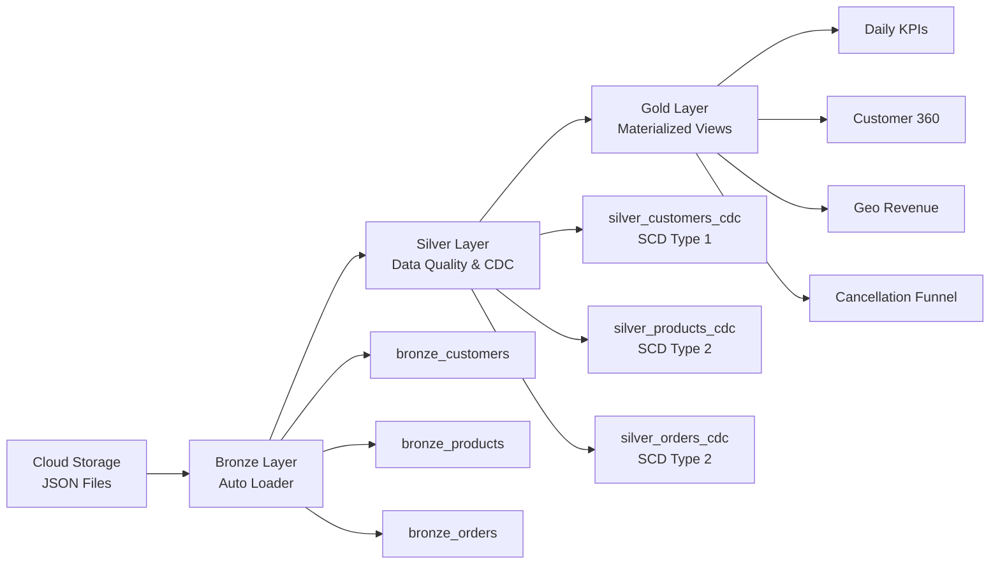
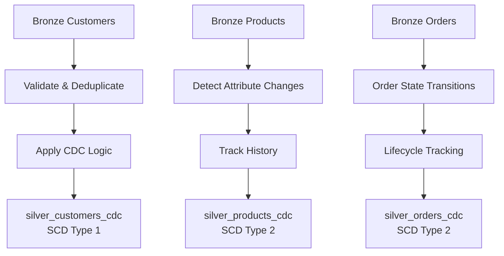
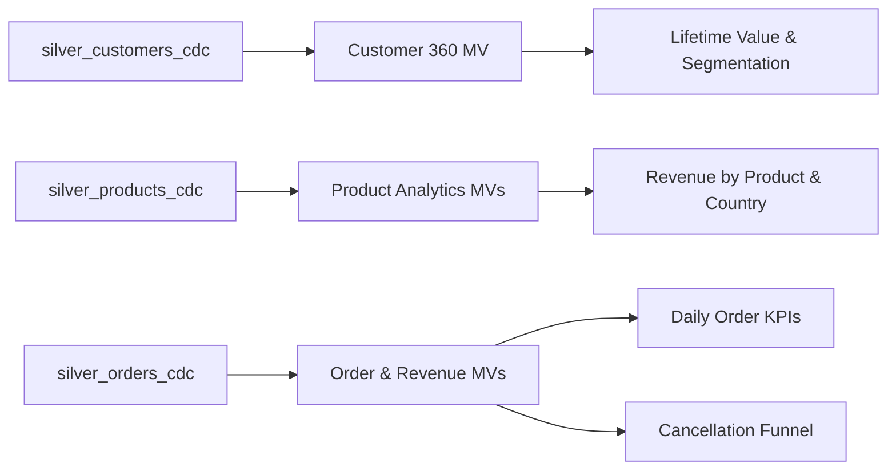

# 🏪 LakehouseMart Data Pipeline

A Spark Declarative Pipeline implementing a full **Medallion Architecture (Bronze → Silver → Gold)** for an e‑commerce analytics platform built on **Databricks Lakehouse**.

---

## 📌 Overview

**LakehouseMart** is an end‑to‑end data pipeline designed for scalable, reliable analytics on e‑commerce data.  
It ingests raw **customer**, **product**, and **order** JSON data from cloud storage, applies **data quality validation** and **Change Data Capture (CDC)** logic, and produces **analytics‑ready Gold materialized views** for business intelligence and reporting.

The pipeline follows Databricks best practices using **Auto Loader**, **streaming tables**, **SCD Type 1 & 2**, and **materialized views**.

---

## 🏗️ Architecture Diagrams

### High‑Level Medallion Architecture



---

### Silver Layer – CDC Processing Model



---

### Gold Layer – Analytics Consumption



---

## 🥉 Bronze Layer — Raw Ingestion

Streaming ingestion of raw JSON files using **Auto Loader** with schema inference and evolution.

**Tables**
- `bronze_customers` — Raw customer data
- `bronze_products` — Raw product catalog data
- `bronze_orders` — Raw order transaction data

---

## 🥈 Silver Layer — Cleaned & CDC‑Enabled

Validated and enriched streaming tables with data quality rules and CDC processing.

**Tables**
- `silver_customers` — Validated customer records (non‑null constraints)
- `silver_customers_cdc` — Current customer state (**SCD Type 1**)
- `silver_products_cdc` — Product history (**SCD Type 2**)
- `silver_orders_cdc` — Order lifecycle history (**SCD Type 2**)

---

## 🥇 Gold Layer — Analytics‑Ready

Materialized views optimized for fast analytics, BI dashboards, and downstream consumption.

**Materialized Views**
- `gold_mv_daily_order_kpis` — Daily revenue, AOV, cancellation rate
- `gold_mv_customer_360` — Unified customer profiles with lifetime value
- `gold_mv_revenue_by_product_country` — Product performance by geography
- `gold_mv_cancellation_funnel` — Cancellation analysis by payment, country, and time

---

## ✨ Key Features

✅ **Auto Loader** — Incremental ingestion with schema inference and evolution  
✅ **CDC Processing** — SCD Type 1 (current state) and Type 2 (historical tracking)  
✅ **Data Quality Enforcement** — Constraint‑based validation with row‑level handling  
✅ **Materialized Views** — Pre‑aggregated KPIs for high‑performance analytics  
✅ **Geographic Analytics** — Country‑level insights for revenue and cancellations  

---

## 🚀 Getting Started

1. **Configure Pipeline**  
   Ensure the pipeline points to:
   ```
   /Workspace/Users/sonet.diu@gmail.com/LakehouseMart/data
   ```

2. **Verify Source Data**  
   Confirm JSON files exist in:
   ```
   /Volumes/db_ws_east_us/raw/raw_files/
   ```

3. **Run the Pipeline**  
   Start with a **full refresh** to initialize all tables

4. **Query Gold Layer**  
   Use materialized views for analytics, dashboards, and reporting

---

## 📎 License & Ownership

Internal analytics pipeline for LakehouseMart.  
Built using **Databricks Lakehouse**, **Spark Declarative Pipelines**, and **Delta Lake**.

---

⭐ If this repository helped you, feel free to star it!
